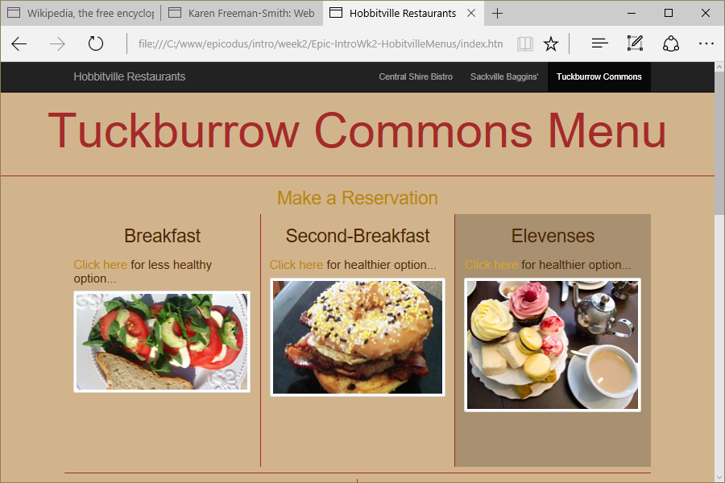

# Hobbitville Restaurants
Version 0.0.2: August 10, 2016
by [Karen Freeman-Smith](https://karenfreemansmith.github.io), [Zachary Matthewstearn](https://zacharymatthewstearn.github.com), and [Adam Gorbahn](https://github.com/Pyrrus)

### Technologies Used
HTML, CSS, Bootstrap, JavaScript, jQuery

## Description
*[Epicodus](http://epicodus.com) Intro to Programming Week 2 Pair Project with Zachary Matthewstearn: Create a webpage that shows/hides images and allows changing backgrounds to explore basic jQuery functions. Added reservation form with Adam Gorbahn.*

* Click on links to alternate between healthy and unhealthy meal choices
* Click on menu items to change theme of menu
* Click on "make a reservation" to see reservation form and response in modal window

## Setup/Installation
* [View on Github Pages](https://karenfreemansmith.github.io/Epic-IntroWk2-HobbitvilleMenus)
* _OR_
* Clone directory
* Open index.html in your favorite browser

## Support & Contact
For questions, concerns, or suggestions please email karenfreemansmith@gmail.com

## Known Issues
* None

## Legal
*Licensed under the GNU General Public License v3.0*

Copyright (c) 2016 Copyright _[Karen Freeman-Smith](https://karenfreemansmith.github.io), [Zachary Matthewstearn](https://zacharymatthewstearn.github.com), & [Adam Gorbahn](https://github.com/Pyrrus)_ All Rights Reserved.
